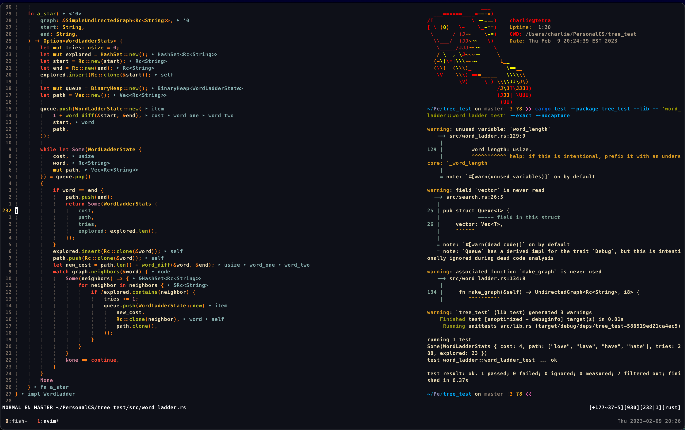
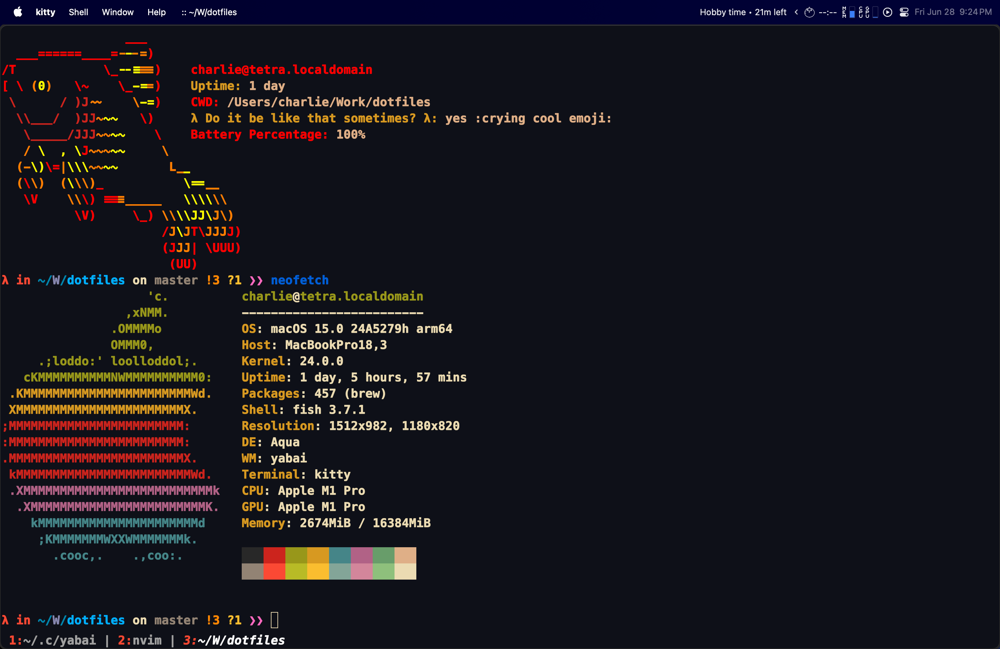
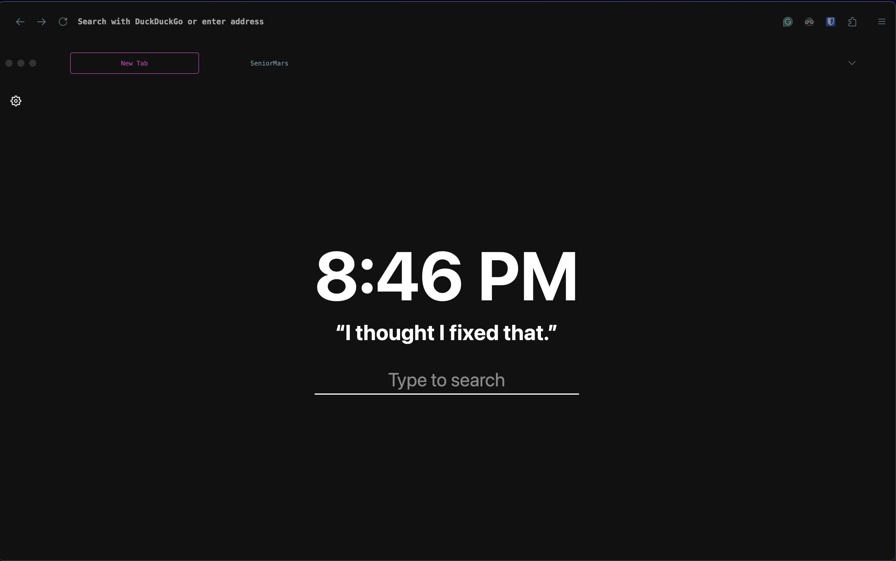
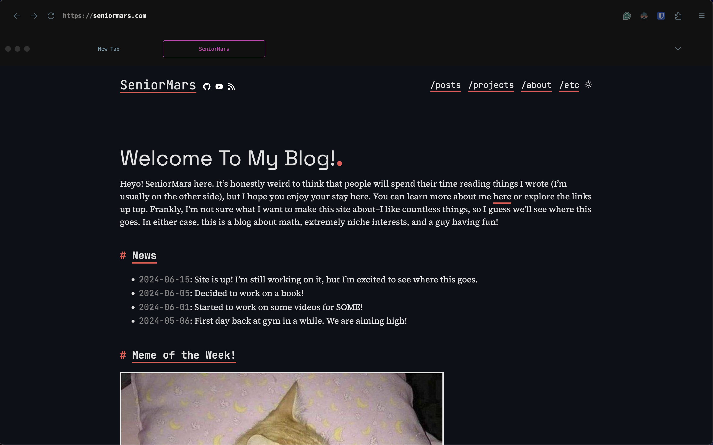

## dotfiles
This is a collection of dotfiles for my personal use. I do not update the documentation, but I do update the code.

I now use a MacBook with the following:

Shell: fish

Mail client: neomutt

Font: Meslo LG M DZ for Powerline patched with ligatures

Terminal Emulator: kitty

window manager: yabai

Overall theme is from Gruvbox, but I made some changes to the colors.

Neofetch (btw the creator of neofetch is now a farmer -- very cool!):

Firefox:

I made a blog to explain my neovim setup: [An Experienced (Neo)Vimmer's Workflow](https://seniormars.com/posts/neovim-workflow/)

Charlie

Old set up, but this repo still contains my dotfiles for my arch linux setup.

---

My 2020 Rice Setup. No, I don't actually use my setup like this everyday.

This is outdated, but when I have time I will update everything. I have learned so much about vim these weeks.

Rice for arch Linux. i3 as my window manager and picom as the compositor.

Currently, all this repo has all my files for my config, but I am working to improve it more.

Screenshot tool: flameshot

Shell: zsh

Mail client: neomutt

Font: Meslo LG M DZ for Powerline

Terminal Emulator: Alacritty

Overall theme is from Gruvbox.

skeleton.tex comes from: https://wso.williams.edu/wiki/index.php/LaTeX_MLA_Template

Running programs: neovim, zathura, feh, tmux, neofetch, gotop, cmus, pipes.sh, vis, firefox and better Discord
