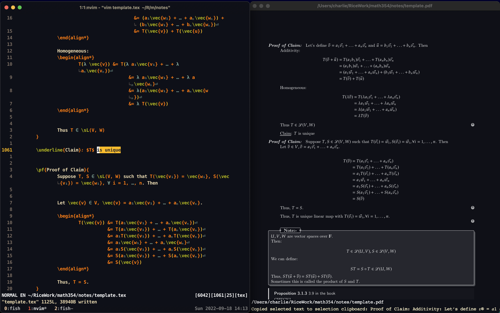
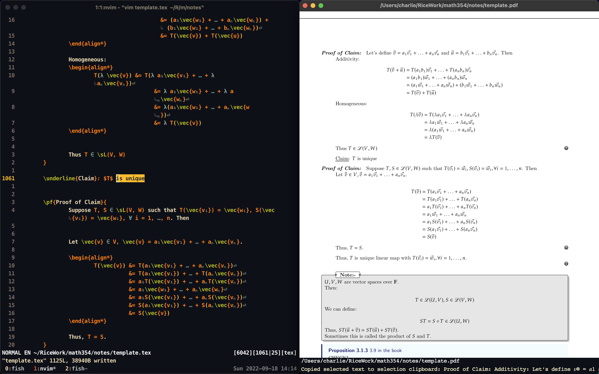

# CMT - Charlie's Math Template

A personal template I have created for my own use.

A lot of the code is from the following sources:
1. https://github.com/tecosaur/BMC
2. https://github.com/lambdasolver/LaTeX


To use:
1. Copy this directory to the same directory as your LaTeX file.
	
	```bash
	$ cp ./letterfonts.tex ./macros.tex ./preamble.tex ./template.tex [some_dir]
	```
	
2. Edit the file "template.tex" to your liking.


!!!! note

    I expect you to be able to install common LaTeX packages like amsmath, amsfonts, and amssymb.
    Also, the dark mode in the picture below is from zathura's dark mode.
    

Pictures:




