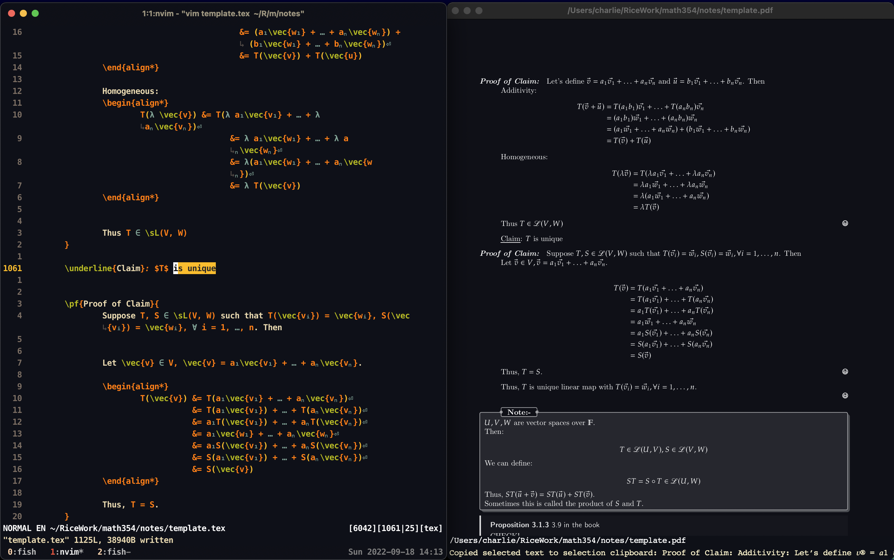
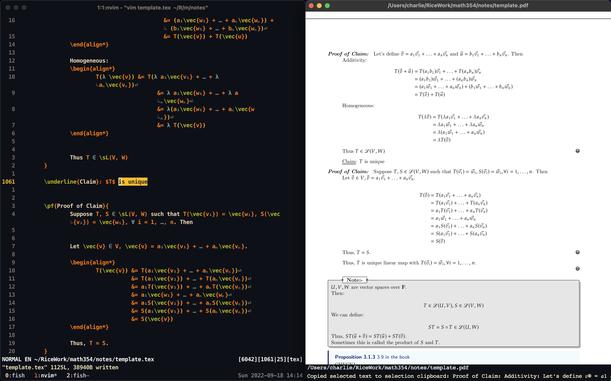

# CMT - Charlie's Math Template

A personal template I have created for my own use.

A lot of the code is from the following sources:
1. https://github.com/tecosaur/BMC
2. https://github.com/lambdasolver/LaTeX


## Usage

`cmt.sty` is the maintained source: it contains the template setup, macros, and
letter fonts directly. Download it beside your `.tex` file:

```bash
curl -LO https://raw.githubusercontent.com/SeniorMars/dotfiles/main/latex_template/cmt.sty
```

Then load it by package name:

```tex
\documentclass{report}
\usepackage{cmt}
```

Build with LuaLaTeX:

```bash
latexmk -lualatex pset.tex
```

If you are working from this repository, `template.tex` is the demo document:

```bash
cp template.tex pset.tex
latexmk -lualatex pset.tex
```

To make `\usepackage{cmt}` work from any folder without an absolute path,
install the template into the local TeX tree:

```bash
mkdir -p ~/Library/texmf/tex/latex/cmt
curl -L https://raw.githubusercontent.com/SeniorMars/dotfiles/main/latex_template/cmt.sty \
  -o ~/Library/texmf/tex/latex/cmt/cmt.sty
```

If this repository is already cloned locally, a symlink is fine instead:

```bash
ln -sf ~/Work/dotfiles/latex_template/cmt.sty ~/Library/texmf/tex/latex/cmt/cmt.sty
```

The old split files are legacy compatibility files. New documents should prefer
`cmt.sty` instead of direct inputs:

```tex
\input{~/Work/dotfiles/latex_template/preamble}
\input{~/Work/dotfiles/latex_template/macros}
\input{~/Work/dotfiles/latex_template/letterfonts}
```

To choose the output PDF filename with `latexmk`, set `CMT_PDFNAME`:

```bash
CMT_PDFNAME=math452-pset01 latexmk -lualatex pset.tex
```

This writes `math452-pset01.pdf`. Direct LuaLaTeX uses the same mechanism:

```bash
lualatex -jobname=math452-pset01 pset.tex
```

The older copy-based workflow also still works, but `cmt.sty` is preferred:

```bash
cp ./letterfonts.tex ./macros.tex ./preamble.tex ./template.tex [some_dir]
```

## Conventions

- `\qs{label}{body}` creates a numbered question box.
- `\pf{Proof}{body}` creates an `amsthm` proof with a custom heading.
- `\sol ...` is the lightweight inline solution heading used in older notes.
- `\begin{sol}...\end{sol}` is intentionally supported as the same lightweight
  solution style.
- `\begin{solution}...\end{solution}` or `\begin{solbox}...\end{solbox}` creates
  a boxed solution.
- `\rmk{title}{body}` creates a lightweight remark box.
- `\begin{codeblock}{Python}...\end{codeblock}` creates a numbered code block.
- `\begin{plaincodeblock}{TeX}...\end{plaincodeblock}` creates an unnumbered code
  block.
- `\begin{consoleblock}...\end{consoleblock}` is for terminal sessions or output.
- `\codeinline|x = y + 1|` creates inline code.
- `\codefile{path/to/file.py}{Python}` includes a source file.
- `\metaname{MATH 452 Pset 1}` sets the PDF metadata title. The alias
  `\cmtpdftitle{...}` does the same thing.
- `\begin{algorithm}[H]...\end{algorithm}` creates styled pseudocode with
  `algorithm2e`.
- The theorem-style environments support `cleveref`; for example,
  `\begin{theorem}{Title}{open-neighborhoods}...\end{theorem}` can be cited as
  `\Cref{th:open-neighborhoods}`.
- Figure and table captions use small sans text with bold sans labels.

> [!NOTE]
> I expect common LaTeX packages like `amsmath`, `amsfonts`, and `amssymb` to be
> installed. The template is tested with LuaLaTeX. The code block environments
> use `listings` inside `tcolorbox`, so they do not need shell escape. The dark
> mode in the picture below is from zathura's dark mode.

Pictures:




